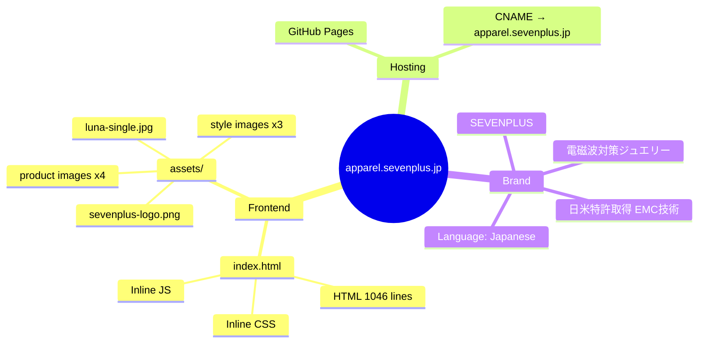

# Architecture

## Key Files

| File | Role |
|------|------|
| `index.html` | Single-page site — all CSS, JS, content inline |
| `assets/` | Product & style photography + logo |
| `CNAME` | Custom domain: apparel.sevenplus.jp |

## Notes

- Single HTML file with embedded styles and scripts (no build toolchain)
- Japanese-language luxury apparel/jewelry brand site
- Static hosting via GitHub Pages
